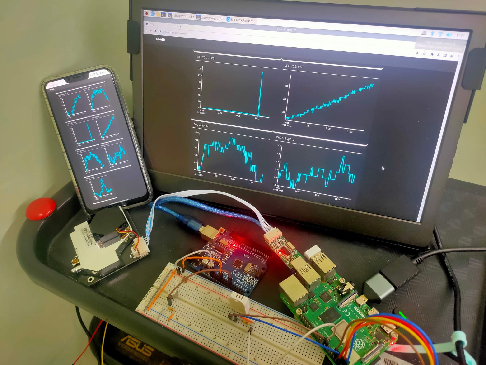
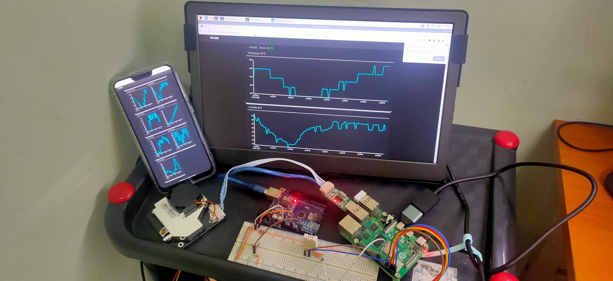
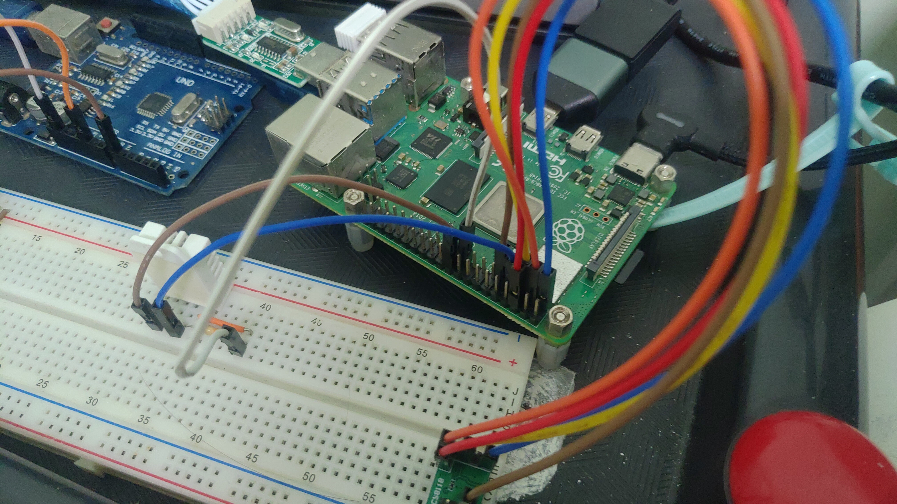
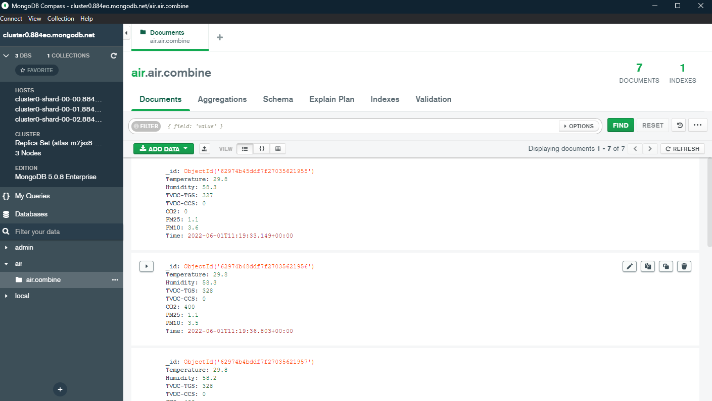
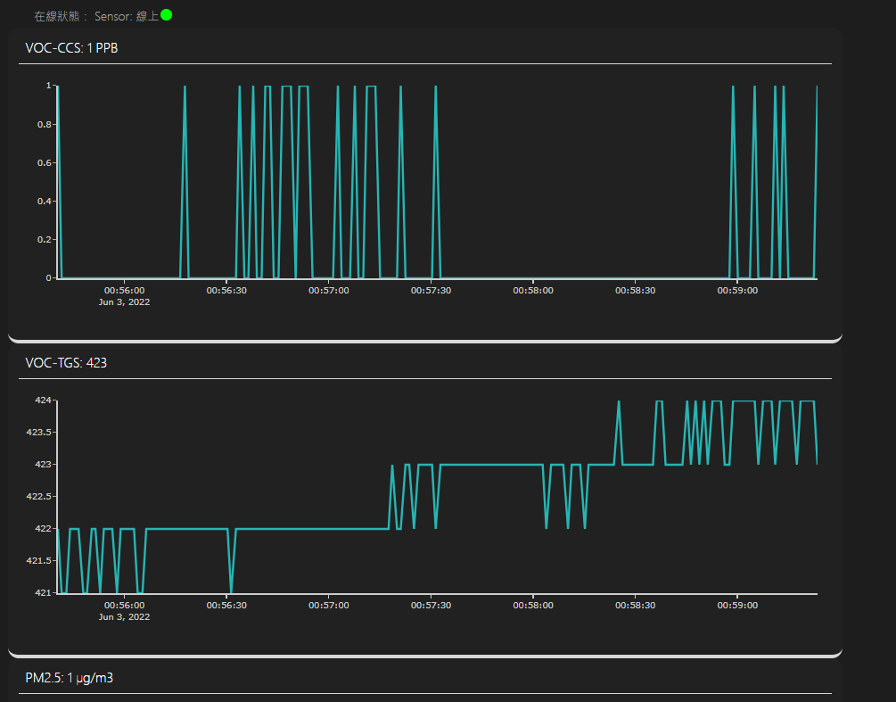

<!-- generated from vault; do not edit -->

## 專案說明

2023 年底跟著線上課程做的即時空氣品質監測儀表板：感測端把量測資料寫進雲端資料庫，網頁端用 Python Dash 做即時視覺化

## 技術構成

- **前端 / 服務**：Python Dash（Flask 基底）+ Plotly 圖表，`dcc.Interval` 每 3 秒輪詢刷新曲線、30 秒刷新主圖
- **資料層**：MongoDB Atlas 雲端資料庫，自寫 `DbWrapper` 封裝查詢
- **狀態偵測**：比對最新一筆資料的時間戳，超過門檻即判定感測器離線，儀表板即時顯示
- **部署**：gunicorn + Procfile，當年部署在 Heroku 型平台

## 現況

已封存。

**GitHub**：[air-detecter](https://github.com/ShaoYong-0921/air-detecter)
