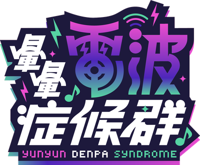

<!-- generated from vault; do not edit -->

# About

資工學生，後端與 DevOps 練習中。

這個網站預計會是我的筆記與作品的公開面。文章寫在 Obsidian，存檔之後由家裡一台樹梅派接手：驗證格式、掃描機密、轉換成網站格式、推上 GitHub，目前還在開發中。

## 這裡預計會有什麼？

- [文章](/archive/)：網站建置、DevOps、學習過程的記錄、刷題記錄
- [作品集](/projects/)：專案與實作介紹

> ### 圖片來源

> - 頭像：Qちゃん，出自《[ゆんゆん電波シンドローム](https://alliance-arts.co.jp/products/yunyun/)》（Alliance Arts）
> - 橫幅：自製

## 致謝

本站主題改自 saicaca 的 **Fuwari**（MIT 授權），並自行移植到 Astro 7。

::github{repo="saicaca/fuwari"}
